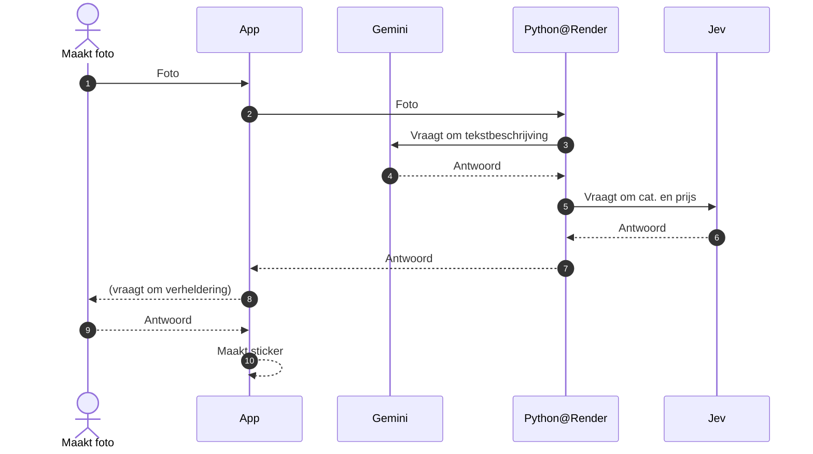

```mermaid
sequenceDiagram
    autonumber
    actor MaaktFoto as Maakt foto
    participant App as App
    participant Gemini as Gemini
    participant Flask as Python@Render
    participant Jev as Jev

    MaaktFoto->>App: Foto
    App->>Flask: Foto
    Flask->>Gemini: Vraagt om tekstbeschrijving
    Gemini-->>Flask: Antwoord
    Flask->>Jev: Vraagt om cat. en prijs
    Jev-->>Flask: Antwoord
    Flask-->>App: Antwoord
    App-->>MaaktFoto: (vraagt om verheldering)
    MaaktFoto-->>App: Antwoord
    App-->>App: Maakt sticker
```